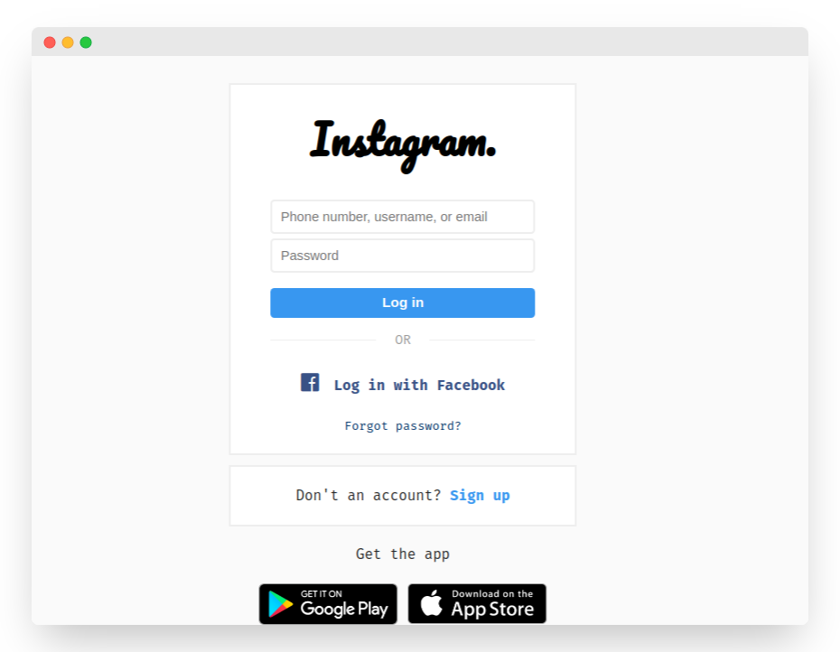

# PHPhisher

A simple tool to create fake instagram web page attacks or can be called phishing.

## Authors

- [@IhsanDevs](https://github.com/IhsanDevs)

## Demo


_More demos coming soon..._

## Installation

1. Clone this project.

```bash
git clone https://github.com/IhsanDevs/Instagram-Phishing && cd Instagram-Phishing
```

2. Install all required composer dependencies.

```bash
composer install
```

3. Create environment files.

```bash
cp .env.example .env
```

4. Adjust the configuration in the `.env` file.

5. Finally, upload all the scripts on your shared hosting service.

## Environment Variables

To run this project, you will need to add the following environment variables to your .env file

1. setting `EMAIL_GMAIL` with the email you will use to send victim data.

2. setting `PASSWORD_GMAIL` with the email password that you will use to send victim data.

3. setting `TARGET_EMAIL` with the email you will use to receive victim data.
